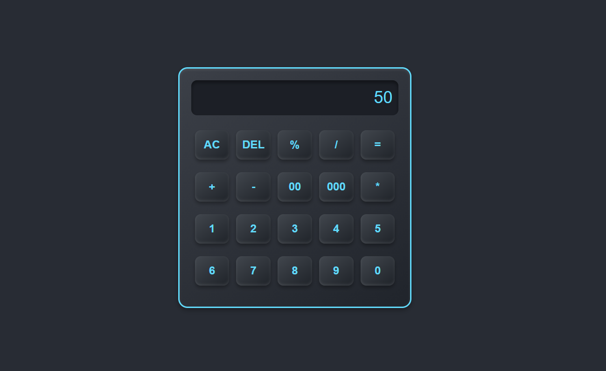

# Calculator Web App

This is a simple web-based calculator built using HTML, CSS, and JavaScript. It supports basic arithmetic operations like addition, subtraction, multiplication, division, percentage calculation, and more. The calculator has a user-friendly interface with buttons for each number, operation, and functions like clear, delete, and calculating percentages.

## Screenshot

Here’s a screenshot of the Calculator Web App:



## Features

- **Basic Operations**: Perform basic arithmetic operations like addition (`+`), subtraction (`-`), multiplication (`*`), and division (`/`).
- **Percentage Calculation**: Easily calculate percentages using the `%` button.
- **Clear and Delete**: Clear the screen with the "AC" button or delete the last character with the "DEL" button.
- **Decimal Points**: Supports decimal points for calculations with the `.` button.
- **User-Friendly Interface**: All buttons are easily accessible and clearly labeled, making it intuitive to use.

## Installation

To run this calculator on your local machine, follow these steps:

1. **Clone this repository** to your local machine:
   ```bash
   git clone https://github.com/Sutharsanjay123/calculator-web-app.git
